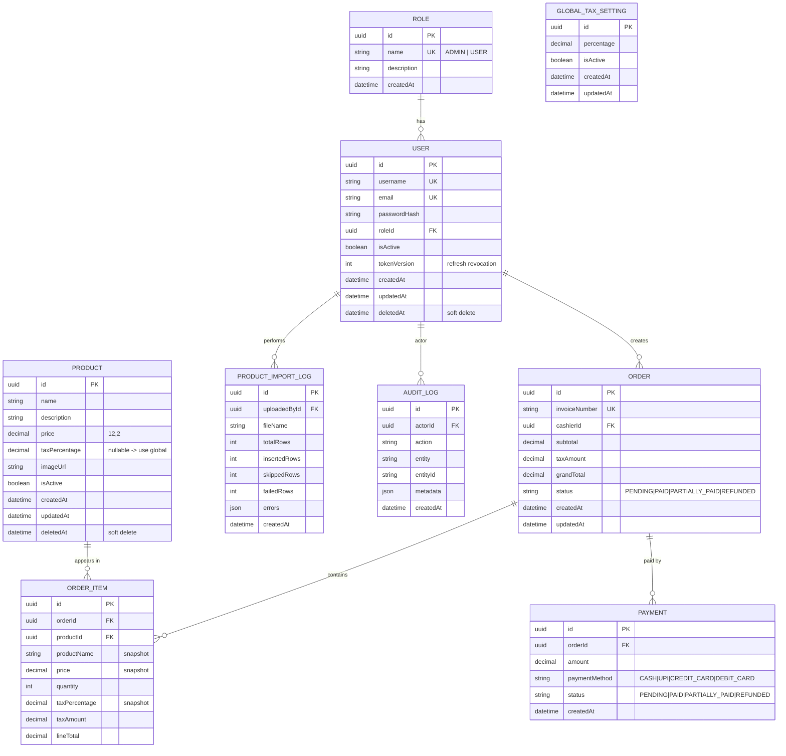

# Entity Relationship Diagram

## Notes

- **UUID** primary keys everywhere (`@default(uuid())`).
- **Soft deletes** on `users` and `products` via `deletedAt`; queries filter
  `deletedAt: null`.
- **Snapshots** in `order_items` (name, price, taxPercentage) keep historical
  invoices stable when products/tax later change.
- **Indexes**: `product.name`, `product.isActive`, `order.invoiceNumber` (unique),
  `order.createdAt`, `order.cashierId`, `order_item.orderId`, `payment.orderId`,
  `user.username`/`email` (unique).
